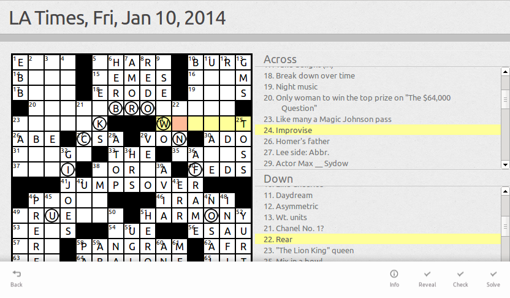

Crosswords for Ubuntu
=====================

Crosswords in a work-in-progress app for Ubuntu, with the goal of
letting you solve your favorite puzzles on your phone, tablet, and
desktop.  At the moment, it is very much an alpha, but you still may
be interested in trying it.

Features
--------
* Lets you play puzzles from the Washington Post, LA Times, Wall Street Journal, and others.
* Checks your answers, get hints, or see the solution when you get stuck.
* Saves your progress (locally for now, but to UbuntuOne when the SDK allows it).
* Adaptive layout adjusts to screen size.
* Panable and zoomable grid helps you see puzzle on small screens.
* Keyboard navigation of grid for desktop use.

Getting It
----------
Crosswords is being developed on [Github][1], so the easiest way to
get it on your computer is to clone the git repository:

git clone https://github.com/rschroll/crosswords.git

If you're not a git person, you can download Crosswords as a
[zip file][2].

Alternatively, you can download it as a [click package][3].

[1]: https://github.com/rschroll/crosswords
[2]: https://github.com/rschroll/crosswords/archive/master.zip
[3]: assets/crosswords_0.1_all.click

Running It
----------
Crosswords is built on Ubuntu's [HTML5 SDK][4], which means it should
run easily everywhere.  That's the theory---in practice it doesn't
word so well.  Here are some notes that might help:

[4]: http://developer.ubuntu.com/api/html5/sdk-14.04/

### On devices (and emulators)

There are a number of bugs that keep Crosswords from running well on
Ubuntu touch devices.  Foremost is that there is no way to trigger
the on-screen keyboard ([#1296462][1296462]).  Without a way to
enter letters, doing crosswords is difficult.  Additional issues
include [#1296463][1296463], [#1296468][1296468], and
[#1296469][1296462].

While actually playing on a touch device will be an exercise in
frustration, testing and bug-hunting would be very useful,
especially since I only have an emulator for these purposes.  Please
[report any bugs](#reporting_bugs) that you find!

[1296462]: https://bugs.launchpad.net/ubuntu-html5-theme/+bug/1296462
[1296463]: https://bugs.launchpad.net/ubuntu-html5-theme/+bug/1296463
[1296468]: https://bugs.launchpad.net/ubuntu-html5-theme/+bug/1296468
[1296469]: https://bugs.launchpad.net/ubuntu-html5-theme/+bug/1296469

### On the desktop

HTML5 apps are supposed to be run with `ubuntu-html5-app-launcher
--www=www`.  Unfortunately, several bugs ([#1293898][1293898],
[#1294981][1294981], [#1294985][1294985]) mean that mouse use in
this environment is sub-optimal.

Instead, you can launch Crosswords inside a simple GTK container
with the `crosswords` script included in the repository.  This is
how I run it myself.  If you feel like [hunting bugs](#reporting_bugs),
note that you can get the inspector from the right-click menu.

Since Crosswords is just HTML, you can also run it in your favorite
web browser: just open up `www/index.html` within the source.  Note
that cross-site scripting restrictions may prevent you from opening
crosswords from some sources.  You may be able to fix this through
your browser's settings.  Also note that list items will not be
visible in Firefox until [#1294993][1294993] is fixed.

[1293898]: https://bugs.launchpad.net/ubuntu-html5-theme/+bug/1293898
[1294981]: https://bugs.launchpad.net/ubuntu-html5-theme/+bug/1294981
[1294985]: https://bugs.launchpad.net/ubuntu-html5-theme/+bug/1294985
[1294993]: https://bugs.launchpad.net/ubuntu-html5-theme/+bug/1294993

### On the web

You don't have to download the source to try it in your
browser---just [click here](www/).  I've trimmed the source list
down to those that will work under the scripting restrictions in a
web environment.  To get the rest, you've got to download it yourself.

Reporting Bugs
--------------
Bugs are tracked on the [Github issues page][5].  Don't be shy---I
enjoy getting bug reports.  It's the best way for me to know that
people are using my software.

[5]: https://github.com/rschroll/crosswords/issues

License
-------
Crosswords is copyright 2014 by [Robert Schroll][6].  It is released
under the [GPL][7].

[6]: http://rschroll.github.io/
[7]: LICENSE.txt
