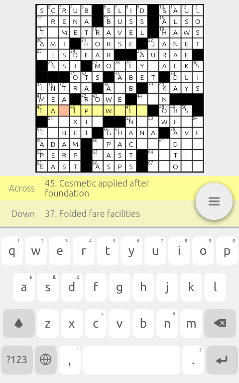

Crosswords for Ubuntu
=====================

Crosswords is an HTML5 application that lets you enjoy crossword puzzles
from a number of online sources.  It can also load puzzles in the
popular Across Lite .PUZ format.  Crosswords was originally written for
Ubuntu, but it should work on any platform with a modern browser.

Features
--------
* Lets you play puzzles from the LA Times, Wall Street Journal, Merl Reagle, and others.
* Loads puzzles in the Across Lite .PUZ format.
* Checks your answers, provides hints, or shows the solution when you get stuck.
* Saves your progress.
* Adaptive layout adjusts to screen size.
* Panable and zoomable grid helps you see puzzle on small screens.
* Keyboard navigation of grid for desktop use.

Running It
----------
As an HTML5 application, Crosswords should run just about everywhere.
The best way to get it depends on how you will be using it.

### On Ubuntu Touch devices

Crosswords is available through the official app store.  [Touch
here](scope://com.canonical.scopes.clickstore?q=Crosswords) on your
Ubuntu device to view and install it from the app store scope.

### On the desktop

Download and extract [this tar
file](https://github.com/rschroll/crosswords/releases/download/0.3.0/crosswords.tar.gz)
to a location of your choosing.  The included `crosswords` script will
open a window with the app loaded.  This script requires Python, GTK,
and WebKitGTK.

Alternatively, you can just open `www/index.html` in your favorite
browser.  Note that some of the puzzles will not be able to be
downloaded due to cross-origin restrictions.  You may be able to work
around these by adjusting your browser's settings.

### On the web

You can try Crosswords right away in your browser---just [click
here](www/).  I've trimmed the source list down to those that will work
under the cross-origin scripting restrictions in a web environment.  To
get the rest, you've got to download it yourself.  (Be aware that the
back button is slightly broken here.)

### For development

Crosswords is being developed on
[Github](https://github.com/rschroll/crosswords), so the easiest way to
get it on your computer is to clone the git repository:

git clone https://github.com/rschroll/crosswords.git

If you're not a git person, you can download Crosswords as a
[zip file](https://github.com/rschroll/crosswords/archive/master.zip).

Crosswords is built with the [Riot](https://muut.com/riotjs/) Javascript
library, and it requires the [Riot
compiler](https://muut.com/riotjs/compiler.html#pre-compilation).  For
more details, see the
[README](https://github.com/rschroll/crosswords/blob/master/README.md).

Reporting Bugs
--------------
Bugs are tracked on the [Github issues
page](https://github.com/rschroll/crosswords/issues).  Don't be shy---I
enjoy getting bug reports.  It's the best way for me to know that people
are using my software.

License
-------
Crosswords is copyright 2014-2015 by [Robert Schroll](http://rschroll.github.io/) and others.  It
is released under the [GPL](LICENSE.txt).
